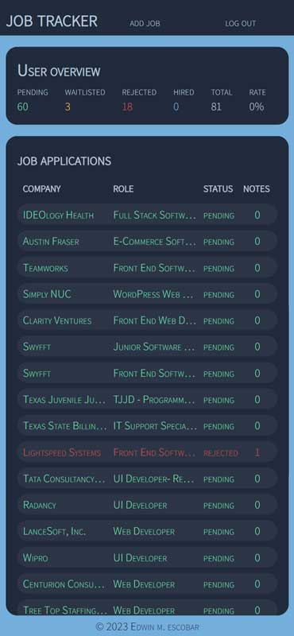
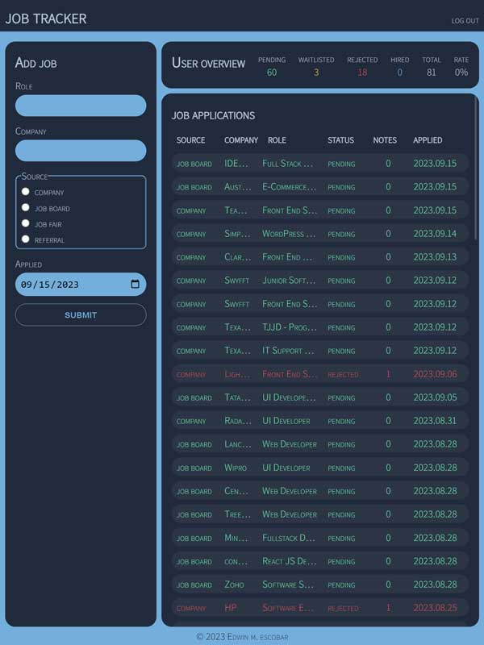
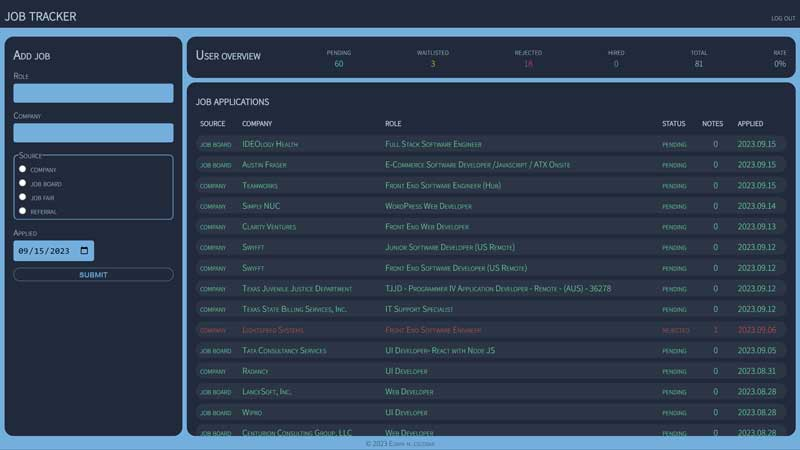

# job-tracker

## Description
[Repo](https://github.com/escowin/job-tracker) | 
[Live URL](https://escowin-job-tracker.onrender.com/)

Tracks the status of job applications. I found my previous method of tracking job applications through an email folder was not useful. By building this app, I was able to further deep dive into the intrices of the MERN stack & GraphQL. The result is now I have a better idea of how many jobs I am applying to and (through Mongoose virtuals) a lit of easy to read statistics in my job hunting pursuit. With this data, I intend to further refine strategy to land a full-time tech industry job.

## Table of Contents
- [Installation](#installation)
- [Test](#test)
- [Usage](#usage)
- [Features](#features)
- [Credits](#credits)
- [Author](#author)

## Installation
Run the following command to install necessary dependencies:
```
$ npm i
```

## Usage
Run the following command to run app:
```
$ npm run develop
```







## Features
* Job Management: Add, edit, and delete job entries with ease. 
* Note Taking: Add and delete notes for each job with any information deemed relevant.
* Job Statistics: Gain insights into your job search progress with comprehensive statistics.
* Real-time Updates: Each mutation automatically refreshes the cached query, ensuring up-to-date information at all times.
* Security: Passwords are encrypted, login is secured through JWT (JSON Web Tokens), and user data is guarded by authentication, providing a secure environment for sensitive information.

## Credits
- Languages: CSS, Javascript, GraphQL
- Frameworks: React, Express, Node 
- Libraries: bcrypt, Mongoose, jwt, react-router-dom 
- Database: mongoDB

## Author
### Edwin Escobar
- [Email](mailto:edwin@escowinart.com)
- [GitHub](https://github.com/escowin)
